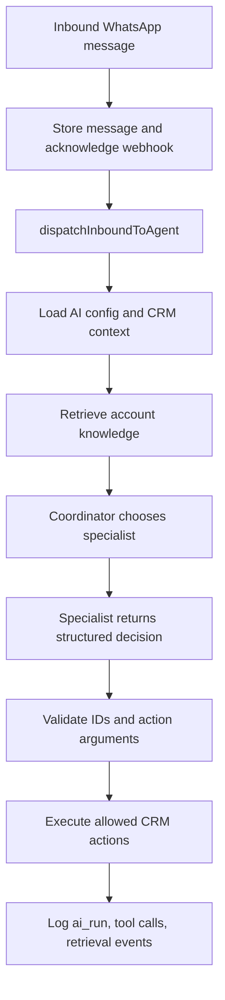

# RAG, Agents, and Multi-Agent Implementation

## Architecture Summary

The current `wacrm` AI surface should evolve incrementally instead of adding a second AI subsystem. The repository already has an account-scoped BYOK AI configuration, provider-agnostic structured JSON generation, a WhatsApp agent dispatcher, deterministic CRM actions, automation generation, and audit points for AI-originated pipeline moves.

RAG should be restored as a new account-scoped knowledge layer because the previous AI knowledge schema was intentionally removed by `supabase/migrations/037_drop_ai.sql`. Multi-agent should be introduced as a registry of CRM-specific specialist roles behind one coordinator, not as independent long-running bots that can write to the CRM directly.

## Recommended Architecture Style

Use the existing modular Next.js + Supabase architecture:

- Next.js App Router route handlers for dashboard APIs and admin actions.
- Supabase Postgres with RLS and service-role execution for webhook/background paths.
- Provider-agnostic AI calls through `src/lib/ai/generate-json.ts`.
- Deterministic action execution through existing CRM helpers.
- Account-scoped knowledge retrieval injected into the current single-decision agent flow.

This keeps the product closer to ByteChef and Dify in capability while preserving the smaller operational footprint of the current app.

## Recommended Stack

| Layer | Choice | Reason |
|---|---|---|
| AI calls | Existing `generateJson<T>()` + focused provider helpers | Matches the current no-SDK pattern and keeps BYOK simple. |
| RAG storage | Supabase Postgres, FTS, pgvector | The repo already targets Supabase and previously used this shape successfully. |
| Ingestion jobs | Postgres job table + route-triggered processing first | Enough for MVP; a durable queue can be added after real volume appears. |
| Agent orchestration | Coordinator + specialist registry | Gives multi-agent behavior without runaway tool loops. |
| Tools/actions | Server-side registry of allowed CRM actions | Lets models propose actions while the backend validates and executes. |
| UI | Settings tabs and existing builder surfaces | Avoids reviving the deleted standalone `/agents` area prematurely. |
| Observability | `ai_runs`, `ai_tool_calls`, `ai_retrieval_events` | Required to debug cost, quality, retrieval misses, and unsafe decisions. |

## Existing Local Assets

- `src/lib/ai/config.ts`: loads and saves encrypted per-account provider config.
- `src/lib/ai/generate-json.ts`: provider-agnostic structured-output call.
- `src/lib/ai/agent-context.ts`: loads recent conversation and linked deal context.
- `src/lib/ai/agent-decide.ts`: asks the model for one sanitized decision.
- `src/lib/ai/agent-dispatch.ts`: executes reply, tags, stage move, and handoff.
- `src/lib/ai/automation-generate.ts`: creates sanitized automation drafts.
- `src/lib/automations/resources.ts`: loads account-scoped tags, pipelines, and stages.
- `supabase/migrations/038_ai_agent.sql`: current AI config and stage-move audit schema.
- `supabase/migrations/039_ai_reply_cap_rpc.sql`: atomic reply-cap claim.

## External Patterns Applied

| Project | Pattern to reuse | Adaptation for `wacrm` |
|---|---|---|
| Inkeep Agents | Visual builder plus SDK/config style, subagents, MCP credentials, traces | Store agent definitions as account-scoped config and keep code-first defaults. |
| LobeHub | Agents as first-class workspace resources, editable memory, plugins | Create named CRM agent roles with editable instructions and knowledge scope. |
| Multica | Agent lifecycle, runtime state, squads, MCP overlay | Add explicit agent runs and a coordinator, but avoid external runtime daemons for MVP. |
| Dafthunk | Visual workflows, async execution, run monitoring | Reuse existing Automations/Flows and add AI nodes later. |
| Dify | RAG pipeline, datasets, model providers, observability | Implement knowledge ingestion, retrieval events, and model-neutral generation. |
| ByteChef | Agents inside workflows, workflows as tools, guardrails, unified audit | Make CRM workflows callable tools only through deterministic backend actions. |

## Target Components

### Knowledge Base

Account-owned documents, chunks, retrieval RPCs, ingestion jobs, and retrieval events. It should support a lexical path for every account and semantic retrieval when OpenAI-compatible embeddings are available.

### Retrieval Layer

`src/lib/ai/knowledge/retrieve.ts` should combine FTS and optional semantic results, dedupe chunks, normalize scores, and return short cited snippets. The agent prompt receives only bounded snippets, not entire documents.

### Agent Registry

Account-owned roles:

- `coordinator`: chooses which specialist handles an event.
- `triage`: classifies intent, urgency, and routing.
- `support`: answers from knowledge snippets.
- `sales`: qualifies lead and proposes pipeline movement.
- `retention`: detects churn or complaint risk and recommends handoff.
- `automation_builder`: drafts automations and later flows.

### Action Registry

The model can only emit action names and arguments. Server code validates every argument against account resources before executing:

- `send_message`
- `add_tag`
- `remove_tag`
- `move_deal_stage`
- `assign_conversation`
- `create_deal`
- `create_automation_draft`
- `create_followup_task`

### Observability

Add a trace model that can answer:

- Which agent handled the event?
- Which model and provider ran?
- Which knowledge chunks were retrieved?
- Which actions were proposed?
- Which actions were executed, rejected, or skipped?
- How many tokens were used?
- Why did the system hand off to a human?

## Data Flow

## Architecture Decisions

| Decision | Reason | Trade-off |
|---|---|---|
| Restore RAG as new schema after migration 040 | `037_drop_ai.sql` dropped the old knowledge tables and RPCs. | Requires a fresh migration instead of reusing old tables. |
| Keep one deterministic executor | Prevents model-generated writes from bypassing tenant and resource validation. | Less flexible than free-form tool loops. |
| Start with coordinator + specialists | Provides multi-agent routing while bounding cost and complexity. | Specialists are configs and prompts first, not autonomous workers. |
| Use lexical retrieval even without embeddings | Every account can use knowledge without a second key. | Lexical misses paraphrases more often. |
| Add semantic retrieval only when embedding config exists | Avoids forcing Anthropic-only accounts into OpenAI embedding spend. | UI must explain degraded retrieval mode. |
| Log AI runs before full dashboards | Debuggability is needed before analytics UI. | Initial release exposes logs mostly for engineering/admin inspection. |

## Risks and Mitigations

| Risk | Mitigation |
|---|---|
| Cross-account knowledge leakage | RLS, account-scoped RPCs, revoked `PUBLIC`, service-role callers always pass `account_id`. |
| Hallucinated IDs or unsafe writes | Sanitizers blank/drop unknown IDs; action registry validates every argument. |
| BYOK cost spikes | Existing rate limits plus per-agent max actions, reply caps, and usage logging. |
| Slow WhatsApp webhook | Keep AI dispatch fire-and-forget and perform ingestion outside webhook response path. |
| Bad RAG answer | Require citations, log retrieved chunks, hand off when confidence or evidence is missing. |
| Agent recursion | No recursive agent calls in MVP; coordinator chooses one specialist per event. |

## Implementation Order

1. Add the RAG schema and retrieval RPCs.
2. Add chunking, embeddings, ingestion, and retrieval modules with unit tests.
3. Add account knowledge APIs and a small Settings UI.
4. Inject retrieved knowledge into the current WhatsApp agent decision.
5. Add `ai_runs`, `ai_tool_calls`, and retrieval logging.
6. Add an agent registry with fixed specialist defaults.
7. Add coordinator routing and per-specialist prompts.
8. Expose safe internal actions as a registry for agent decisions.

## Open Questions

- Should embeddings reuse the account's OpenAI chat key when provider is OpenAI, or require a separate embeddings key?
- Should knowledge management live under `Settings -> AI agent` first, or get its own `Settings -> Knowledge` section?
- Should flows be generated by the automation copilot in the same release, or stay out of scope until RAG is proven?
- Which users may inspect AI run logs: admin-only or agent-plus?
